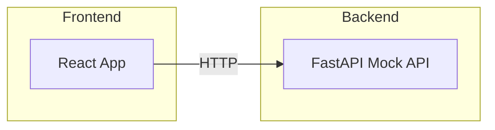
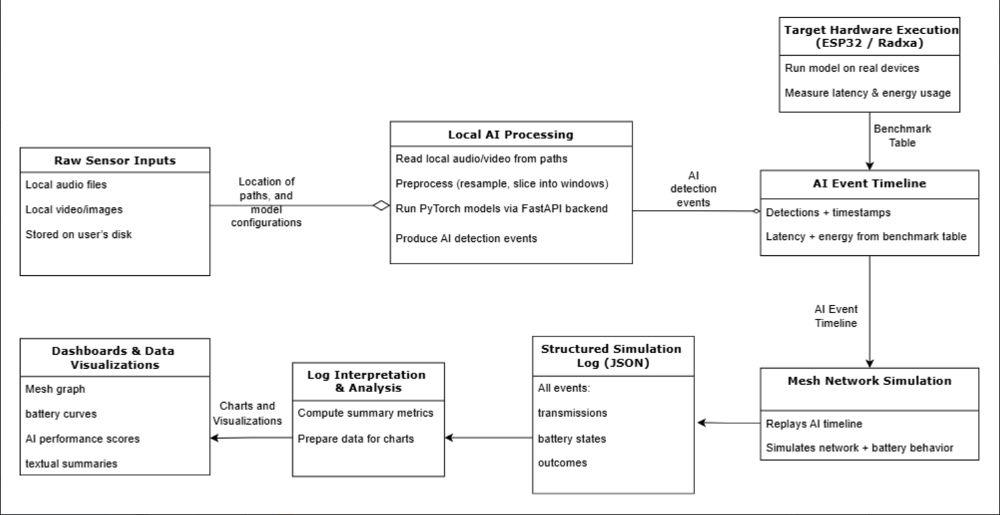

# Shaman Digital Twin — Architecture

System Architecture

- Frontend (React)
- Backend (FastAPI)

# Digital Twin UI + Mock API

This repository contains a Vite React frontend and a FastAPI backend scaffold with mock endpoints. The goal is to provide an end-to-end flow where the React UI populates fields and graphs from API responses (mock data for now).

Frontend:
- Folder: `frontend`
- Start dev server: `npm install` then `npm run dev` (from `frontend`)

Backend:
- Folder: `backend`
- Create virtualenv and install: `python -m venv .venv && .venv\Scripts\pip install -r requirements.txt`
- Run: `uvicorn app.main:app --reload --port 8000` (from `backend`)
